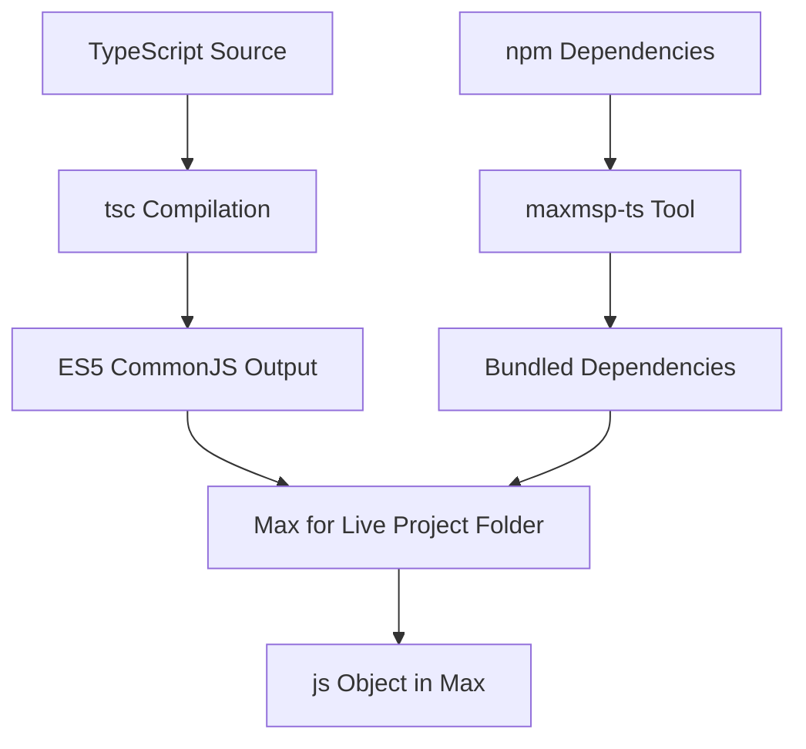

# TypeScript Compilation for Max for Live Development

## Overview

This document explains how TypeScript compilation works in the Max for Live context for ALITS projects. Understanding this workflow is critical for AI developers working on Max for Live devices.

## Key Concepts

### 1. Max for Live JavaScript Environment Constraints

Max for Live uses **JavaScript 1.8.5 (ES5-based)** with significant limitations:
- **No ES6+ features**: No native `Map`, `Set`, `Promise`, `async/await`
- **No DOM APIs**: No `setTimeout`, `setInterval`, `window` object
- **No Node.js APIs**: No `require()` for modules (except built-in Max objects)
- **No npm modules**: Cannot directly import npm packages

### 2. TypeScript Compilation Strategy

We use a **two-stage compilation process**:

1. **TypeScript → ES5 CommonJS**: Compile TypeScript to ES5 CommonJS modules
2. **Dependency Bundling**: Bundle npm dependencies into Max-compatible files

## Workflow Architecture

### Build Process



### File Structure

```
apps/kebricide/
├── src/
│   └── kebricide.ts          # TypeScript source
├── Project/                  # Max for Live project folder
│   ├── kebricide.js          # Compiled JavaScript
│   ├── alits_index.js        # Bundled dependency
│   └── kebricide.amxd        # Max for Live device
├── maxmsp.config.json        # Dependency configuration
├── tsconfig.json             # TypeScript configuration
└── package.json              # Build scripts
```

## Configuration Files

### 1. `tsconfig.json` - TypeScript Configuration

```json
{
  "compileOnSave": true,
  "compilerOptions": {
    "module": "CommonJS",        // Required for Max compatibility
    "target": "ES5",             // Max 8 uses ES5
    "strict": true,
    "sourceMap": false,          // Disabled for Max compatibility
    "outDir": "./Project",       // Output to Max project folder
    "baseUrl": "src",
    "types": ["maxmsp"],         // Max/MSP type definitions
    "lib": ["es5"]               // ES5 library only
  },
  "include": ["./src/**/*.ts"]
}
```

**Critical Settings:**
- `"module": "CommonJS"` - Required for Max compatibility
- `"target": "ES5"` - Max 8 JavaScript engine limitation
- `"outDir": "./Project"` - Must output to Max project folder
- `"sourceMap": false"` - Max doesn't support source maps

### 2. `maxmsp.config.json` - Dependency Configuration

```json
{
  "output_path": "",
  "dependencies": {
    "@alits/core": {
      "alias": "alits",
      "files": ["index.js"],
      "path": "",
      "exclude": ["rxjs"]
    }
  }
}
```

**Configuration Fields:**
- **`output_path`**: Subdirectory for bundled files (empty = root of outDir)
- **`alias`**: Prefix for bundled files (e.g., "alits" → "alits_index.js")
- **`files`**: Array of files to copy from package's dist directory
- **`path`**: Subdirectory within output_path (usually empty)
- **`exclude`**: Array of packages to exclude from bundling (optional)

**Purpose:** Tells the maxmsp-ts tool how to bundle npm dependencies for Max.

**File Naming Convention:**
- Package `@alits/core` with alias `alits` → `alits_index.js`
- Package `my-library` with alias `mylib` → `mylib_index.js`
- Sanitized names replace `/` and `.` with `-` characters

### 3. `package.json` - Build Scripts

```json
{
  "scripts": {
    "build": "node ../../packages/maxmsp-ts/dist/index.js build",
    "dev": "node ../../packages/maxmsp-ts/dist/index.js dev"
  }
}
```

## Compilation Process

The `maxmsp-ts` tool implements a **two-stage build process**:

### Stage 1: TypeScript Compilation

The tool runs `tsc` to compile TypeScript to CommonJS:

```bash
npx tsc
```

**Input:** `src/kebricide.ts`
```typescript
import * as alits from "@alits/core";

inlets = 1;
outlets = 1;
autowatch = 1;

function bang() {
  post("Testing: " + alits.greet() + "\n");
}

bang();

// Required for Max compatibility
let module = {};
export = {};
```

**Intermediate Output:** `Project/kebricide.js` (before post-processing)
```javascript
"use strict";
var alits = require("@alits/core");
inlets = 1;
outlets = 1;
autowatch = 1;
function bang() {
    post("Testing: " + alits.greet() + "\n");
}
bang();
var module = {};
module.exports = {};
```

### Stage 2: Dependency Bundling & Post-Processing

The `maxmsp-ts` tool performs several operations:

#### 2.1 Dependency File Copying
- **Source**: `node_modules/@alits/core/dist/index.js`
- **Destination**: `Project/alits_index.js` (prefixed with alias)
- **Purpose**: Bundle dependencies as standalone files

#### 2.2 Require Statement Replacement
The tool scans all `.js` files in the output directory and replaces **both quote styles**:

```javascript
// Before post-processing (TypeScript can generate either quote style)
require("@alits/core")  // Double quotes
require('@alits/core')  // Single quotes

// After post-processing (both become the same bundled file)
require("alits_index.js")
require("alits_index.js")
```

**Why both quote styles?** TypeScript's CommonJS compilation can generate either single or double quotes depending on the original import syntax. The maxmsp-ts tool handles both cases to ensure all require statements are properly updated to point to bundled files.

#### 2.3 Final Output
**Final Output:** `Project/kebricide.js` (after post-processing)
```javascript
"use strict";
var alits = require("alits_index.js");
inlets = 1;
outlets = 1;
autowatch = 1;
function bang() {
    post("Testing: " + alits.greet() + "\n");
}
bang();
var module = {};
module.exports = {};
```

### How maxmsp-ts Works Internally

The `maxmsp-ts` tool is implemented as a Node.js CLI that:

1. **Reads Configuration**: Parses `maxmsp.config.json` to understand dependencies
2. **Spawns TypeScript Compiler**: Runs `npx tsc` with project's `tsconfig.json`
3. **Post-Processes Output**: 
   - Copies dependency files from `node_modules` to output directory
   - Renames files with alias prefixes to avoid conflicts
   - Updates all `require()` statements to point to bundled files
4. **Handles File Watching**: In `dev` mode, watches `src/` directory for changes

**Key Implementation Details:**
- Uses `child_process.spawn()` to run TypeScript compiler
- Implements recursive file scanning with `fs.readdir()` and `fs.stat()`
- Uses string replacement with regex patterns for require statements
- Supports both `require("package")` and `require('package')` syntax
- Skips processing files in `lib/` subdirectories to avoid conflicts

## Max for Live Integration

### JavaScript Object Usage

In Max for Live, the compiled JavaScript runs in a `[js]` object:

1. **File Reference**: `[js kebricide.js]` loads the compiled file
2. **Auto-reload**: `autowatch = 1` enables automatic reloading on file changes
3. **Max Globals**: `inlets`, `outlets`, `post()` are Max-specific globals

### Development Workflow

1. **Write TypeScript**: Edit `src/kebricide.ts`
2. **Run Build**: `pnpm run build` or `pnpm run dev`
3. **Test in Max**: The `[js]` object automatically reloads
4. **Debug**: Use `post()` for console output in Max

## Critical Requirements for AI Developers

### 1. Max Compatibility Patterns

**Always include these at the end of TypeScript files:**
```typescript
// Required for Max compatibility
let module = {};
export = {};
```

**Use Max globals:**
```typescript
inlets = 1;        // Number of inlets
outlets = 1;       // Number of outlets
autowatch = 1;     // Auto-reload on file changes
post("message");   // Console output
```

### 2. Import/Export Strategy

**TypeScript Import Patterns and CommonJS Translation:**

The `maxmsp-ts` tool relies on TypeScript's built-in CommonJS compilation. Here's how different import patterns are translated:

**Namespace Imports (Recommended):**
```typescript
import * as alits from "@alits/core";
// Compiles to: var alits = require("@alits/core");
// After maxmsp-ts: var alits = require("alits_index.js");
```

**Destructured Imports:**
```typescript
import { greet } from "@alits/core";
// Compiles to: var core_1 = require("@alits/core");
// Usage: (0, core_1.greet)();
// After maxmsp-ts: var core_1 = require("alits_index.js");
```

**Mixed Imports:**
```typescript
import { greet, LiveSet } from "@alits/core";
// Compiles to: var core_1 = require("@alits/core");
// Usage: (0, core_1.greet)(); (0, core_1.LiveSet)();
```

**Key Observations:**
- **Namespace imports** (`import * as`) create cleaner, more readable CommonJS output
- **Destructured imports** use the `(0, module.function)()` pattern to preserve `this` context
- **Both patterns work** in Max for Live, but namespace imports are more maintainable
- **maxmsp-ts post-processing** updates all `require("@package")` statements to point to bundled files

**Avoid ES6 module exports:**
```typescript
// ❌ Don't do this - ES6 exports don't work in Max
export function myFunction() { }

// ✅ Functions are available globally in Max
function myFunction() { }
```

**Note**: RxJS dependencies can cause TypeScript compilation issues due to DOM dependencies (setTimeout, etc.). Use `"skipLibCheck": true` and `"skipDefaultLibCheck": true` in tsconfig.json to avoid these issues.

### 3. Dependency Management

**Add dependencies via maxmsp-ts:**
```bash
# Add a dependency
node ../../packages/maxmsp-ts/dist/index.js add @alits/core --alias alits

# Remove a dependency
node ../../packages/maxmsp-ts/dist/index.js rm @alits/core
```

**Dependencies are bundled, not imported:**
- All npm dependencies become standalone files
- No `node_modules` in Max project folder
- All `require()` statements point to local files

### 4. Build Commands

**Development (with watching):**
```bash
pnpm run dev
```

**Production build:**
```bash
pnpm run build
```

**Manual TypeScript compilation:**
```bash
npx tsc
```

## Common Pitfalls

### 1. TypeScript Compilation Errors

**RxJS/DOM Type Conflicts:**
```bash
# Error: Cannot find name 'setTimeout'
error TS2304: Cannot find name 'setTimeout'
```

**Solution:** Add to `tsconfig.json`:
```json
{
  "compilerOptions": {
    "skipLibCheck": true,
    "skipDefaultLibCheck": true,
    "lib": ["es5"]  // Remove "es2015", "dom", etc.
  }
}
```

**Duplicate Type Definitions:**
```bash
# Error: Duplicate identifier 'Buffer'
error TS2300: Duplicate identifier 'Buffer'
```

**Solution:** Ensure `tsconfig.json` excludes conflicting type definitions:
```json
{
  "exclude": ["node_modules", "../../node_modules"]
}
```

### 2. ES6+ Features
```typescript
// ❌ These won't work in Max
const map = new Map();
const set = new Set();
async function myFunc() { }
const arrow = () => { };

// ✅ Use ES5 equivalents
const obj = {};
const arr = [];
function myFunc() { }
function regular() { }
```

### 3. Node.js APIs
```typescript
// ❌ These don't exist in Max
setTimeout(() => {}, 1000);
setInterval(() => {}, 1000);
process.exit();

// ✅ Use Max alternatives
// Use Max's task object for timing
// Use Max's bang for intervals
```

### 4. Module Exports
```typescript
// ❌ ES6 exports don't work
export function myFunc() { }

// ✅ Functions are global in Max
function myFunc() { }
```

### 5. Import/Require Issues

**Problem:** `require("@alits/core")` not updated to bundled file
**Solution:** Ensure `maxmsp.config.json` is properly configured and run `pnpm run build`

**Problem:** Functions undefined in Max
**Solution:** Check that bundled file contains the exports:
```javascript
// In Project/alits_index.js
exports.greet = greet;
```

**Problem:** Import patterns not working as expected
**Solution:** Use namespace imports for cleaner CommonJS output:
```typescript
// ✅ Recommended
import * as alits from "@alits/core";
alits.greet();

// ⚠️ Works but creates complex output
import { greet } from "@alits/core";
greet();
```

## Debugging

### Console Output
```typescript
post("Debug message: " + value + "\n");
```

### Error Handling
```typescript
try {
    // Max code
} catch (error) {
    post("Error: " + error + "\n");
}
```

### File Watching
The `dev` command watches for changes and automatically rebuilds:
```bash
pnpm run dev
```

## Summary

The TypeScript compilation workflow for Max for Live involves a sophisticated two-stage process:

### Stage 1: TypeScript → CommonJS
1. **Write TypeScript** with Max compatibility patterns
2. **Configure TypeScript** (`tsconfig.json`) for ES5 CommonJS output
3. **Use appropriate import patterns** (namespace imports recommended)
4. **Run `tsc`** to compile TypeScript to CommonJS

### Stage 2: Dependency Bundling & Post-Processing
1. **Configure dependencies** in `maxmsp.config.json`
2. **Run maxmsp-ts tool** which:
   - Copies dependency files from `node_modules` to output directory
   - Renames files with alias prefixes to avoid conflicts
   - Updates all `require()` statements to point to bundled files
3. **Test in Max** using `[js]` objects
4. **Debug with post()** statements

### Key Technical Insights

**Import Pattern Translation:**
- `import * as pkg from "package"` → `var pkg = require("package")`
- `import { func } from "package"` → `var pkg_1 = require("package"); (0, pkg_1.func)()`

**Dependency Bundling:**
- All npm dependencies become standalone files in the Max project folder
- No `node_modules` in Max project folder
- All `require()` statements point to local bundled files
- File naming: `package@alias` → `alias_index.js`

**Max Compatibility:**
- Functions are available globally in Max (no ES6 exports)
- Use Max globals: `inlets`, `outlets`, `autowatch`, `post()`
- Always include compatibility patterns: `let module = {}; export = {};`

This workflow enables modern TypeScript development while maintaining compatibility with Max for Live's JavaScript 1.8.5 environment.
